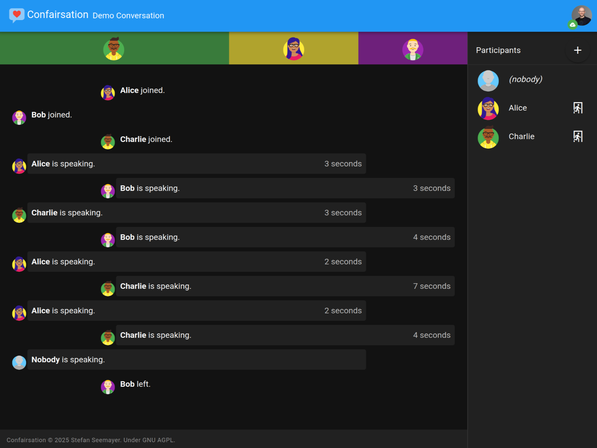

#  Confairsation

> Fairer conversations by helping everyone get a chance to speak

Confairsation is a tool for measuring how much time various participants of a conversation spend speaking. If someone dominates the conversation, their speaker bar will clearly show so, hopefully hinting them to give others a chance to participate as well.

## Installation

Easiest via Docker Compose.

 1. Make an environment file `cp env.sample env` -- **and adjust it with your own secret settings!**
 2. `docker compose up`

You can then go to [localhost:3000](http://localhost:3000) to see the Confairsation frontend

## Contributions

Contributions are welcome. This is a hobby project, so please be patient with me.
